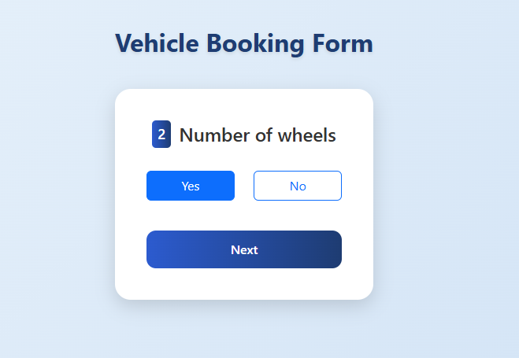
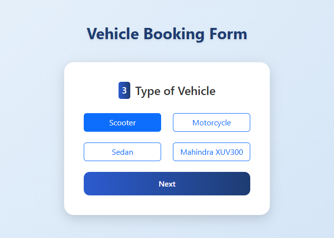
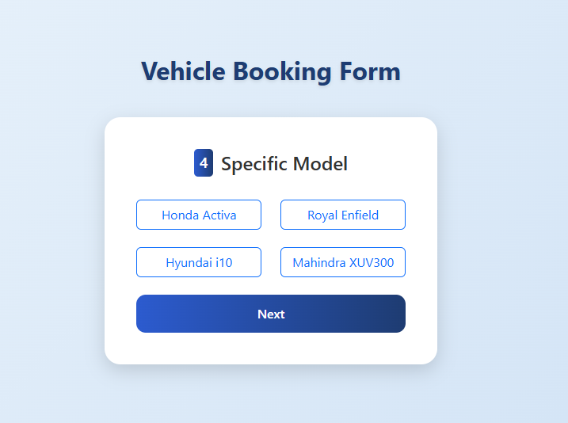
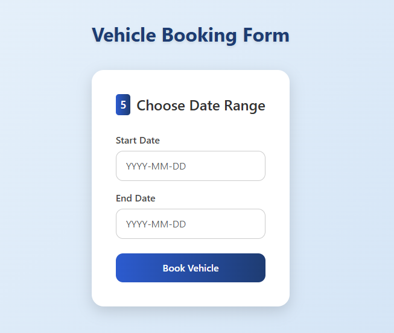

# Octalogic (Vehicle Booking Form)

A modern React-based Form

## UI Screenshots

###  Page 1 - What is your name
![Page 1](./screenshot/page1.PNG

### Page 2 - Number of wheels


### Page 3 - Type of Vehicle


### Page 4 - Specific Model


###  Page 5 - Choose Date Range


## Tech Stack

- React
- Formik + Yup
- React-Bootstrap

##  Folder Structure

Octalogic/
├── public/
├── src/
│   ├── components
│   |   ├── BookingForm.js
│   ├── data
│   |   ├── EndPoints.js
│   ├── App.js
│   ├── .index.js
├── screenshot/
│   ├── page1.png
│   ├── page2.png
│   ├── page3.png
│   ├── page4.png
│   └── page5.png
├── .gitignore
├── package.json
├── README.md

## Getting Started

```bash
npm install
npm start

